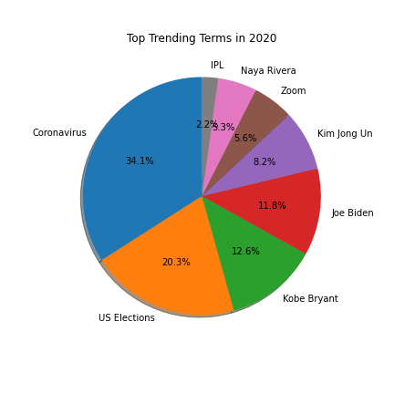
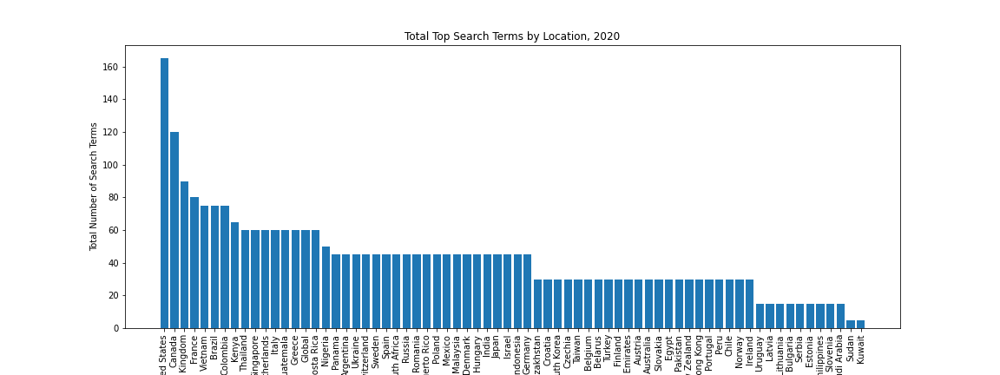
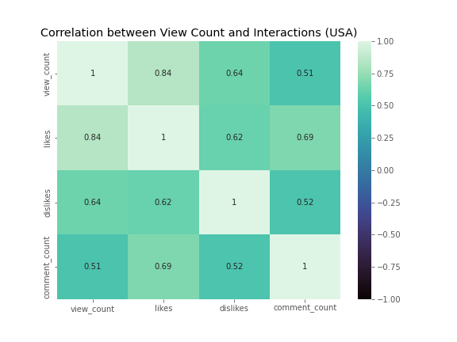
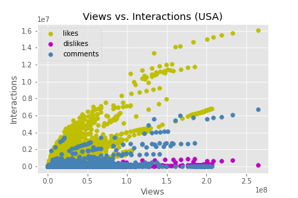
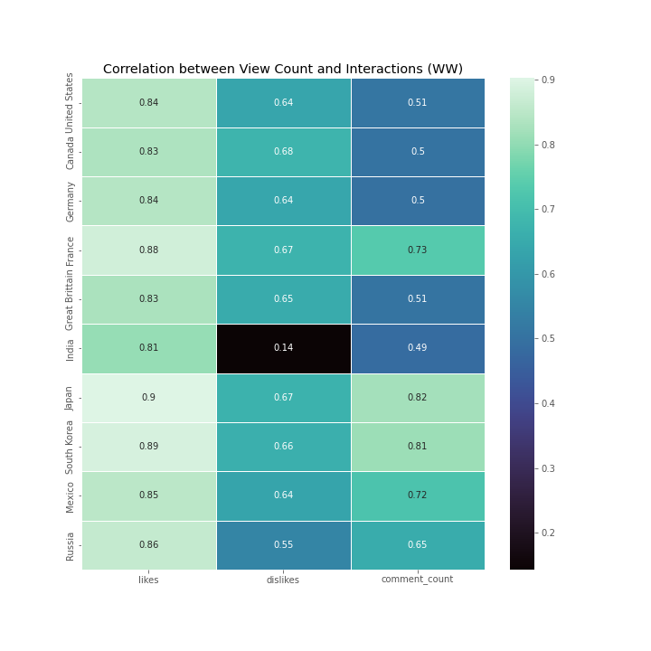
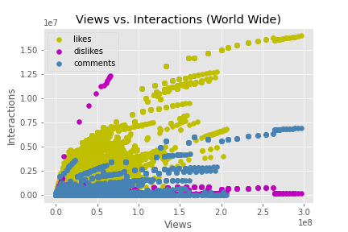
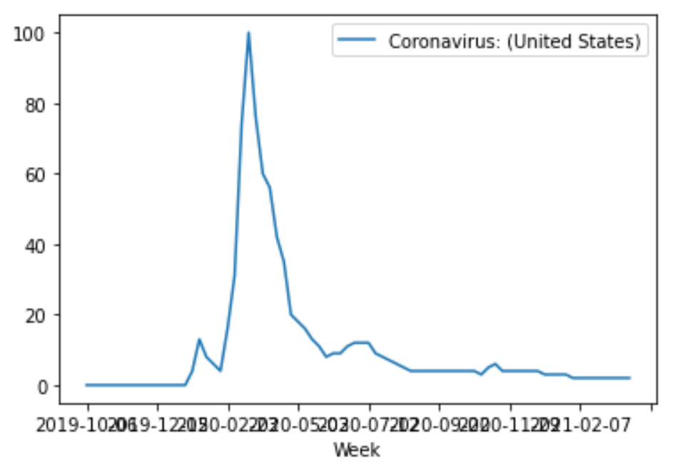
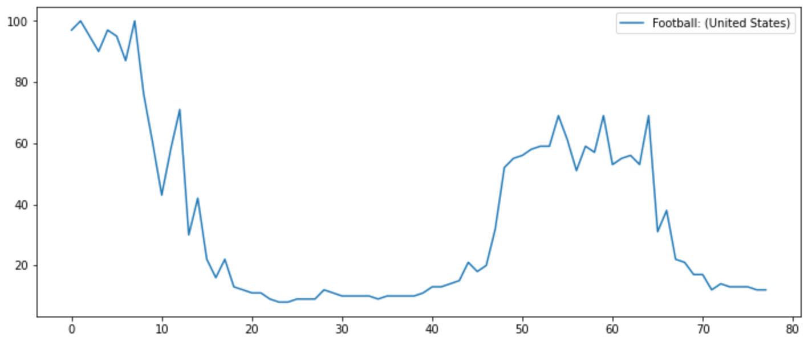
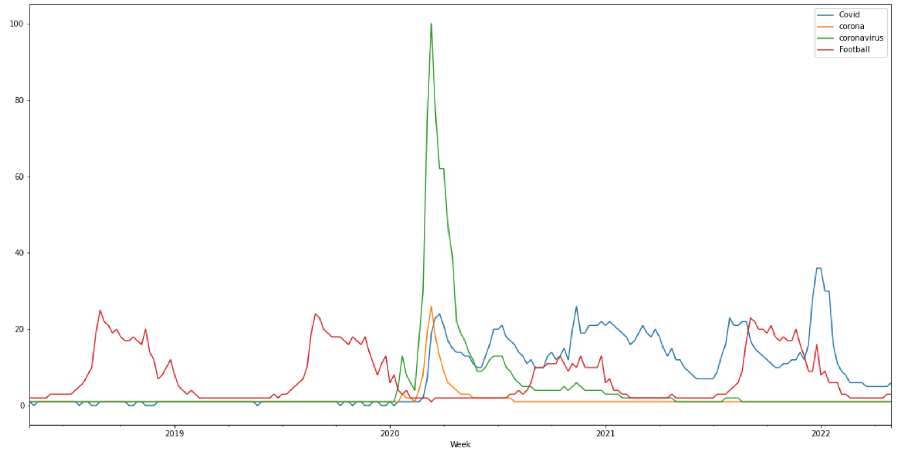

***

 **Team Members:** Ray Yoon, Nikki Dao, Scott Alexander, Kenzie Gelbart

# Motivation
  ***
  
  A trend is defined as the overall direction of a market during a specified period of time. We use this comparative method to research and gather data in order to predict future movements, based on what can be observed in the past. Trending analysis can help spot new trends by looking at past patterns, and also helps us understand the current state of our operations.
<ul>
     <li>	In this project, we are utilizing Google Trends to explore popularity of a search keyword based on location, timeframe, category, and search type. </li>
 <li>	We are also utilizing popular social media platforms such as YouTube to explore video trends and user behaviors to analyze certain factors would determine a trend. </li>
<li>	We also compare trends from Twitter API and Google Trends based on popular keywords by narrowing down to one category of popular sport leagues.  </li>
<li>	Furthermore, we’re interested to see a comparative analysis solely using Google Trends by narrowing down to just 2 specific categories. </li>
 
</ul>

# Questions Addressed
 ***
  <ol>
   <li> Google Trends: What are the trending searches on google from 2019-2020, in the world?</li>
<li>YouTube: Will number of the views, likes, dislikes, and comments determines the trend?</li>
<li>Twitter API vs. Google Trends: Which are the most popular sport leagues in the past week?</li>
<li>Google Trends: Is there a Correlation Between Google Search Trends for Covid-19 and Football?</li>
</ol>

#### Hypothesis 1:
 The top trends will be defined by the terms that appear the most times in the most locations.

 

>Findings and Observations:

  

The top trends would be the terms that occured in the most locations, representing what the most people have searched for. After performing analysis, we can confirm that terms present in more locations are more likely to be globally trending.  
This is possible even without the exact metrics of how many times a particular term was searched for.
If there were publicly available metrics, more refined conclusions would be drawn.  
  

  

Whether these global trends are truly definitive of the global population as a whole, however, is something to question. It's likely that the locations with more data would have a greater influence in defining a top trend. From the data at hand, we can infer:
 * Locations that contribute more data will have a greater effect on what the top results will be.
 * Population (in terms of a country's people) may also have an effect on defining trends. The more people that have access to Google, the more likely it is that terms from that location will be surging in popularity.
 * Some locations do not want to share information with Google, for a number of reasons. This directly affects the overall data available on Google Trends, and may indicate that some terms may be missing, or should be more/less prevalent.
***

#### Hypothese 2:
 
 The relationship between view counts and user interactions will determines if the specific content is trending or not. Higher the view counts, comment counts, number of likes and dislikes will put a video on trending list.
 

>Findings and Observations: 

 __[Link to download Youtube Data](https://www.kaggle.com/datasets/rsrishav/youtube-trending-video-dataset)__

To test the theory, we performed the Pearsons correlation coefficient test, to find what our R will be. Our sample data is US data, from 2020-2022, on Youtube Platform. In our findings, we found a strong correlation between view count and user interactions, consist with number of likes, dislikes, and comment counts.

  
This heatmap shows that there is a very strong positive correlation with view count and number of likes, while there is a moderate correlation between view_count and dislikes/comment_count

Based on Pearson correlation values:

   1 = a strong positive correlation

   0 = no correlation

  -1 = strong negative correlation.

However, in this scatter splot, we found that at a certain point, as the view counts continues to increase, the user interactions suddendly dropped significantly. With this finding we reject the hypothesis of having higher views will result in higher user interactions, which leads to trending list. 

To take it even further, we applied the same method with the data of 10 countries (United States, Canada, Germany, France, Great Brittain, India, Japan, South Korea,Mexico, Russia), which we did find similar results as US sample data. 

We can see that all ten countries does have strong correlation between View Counts and nunber of likes. There is an interesting find of India having number of dislikes misrepresented in the data. But without seeing this data in a timelapse format, it's hard to determine if a particular variable is the cause of the other.

This world wide scatter plot demontrates similar trends with US data. This evidence allows us to reject the hypothesis. However, it begs the questions of once the video became trending, does it acquire a new set of viewers that doesn’t like to leave interactions. Or does Youtube algorithm changes after a video became trending? Or is there other determining factors we did not include, such as subscriber count, advertisement friendly content, etc..? 

#### Hypothese 3 : 
***
The amount of tweets for the twitter accounts for each team and league in each of the top professional sports leagues will be counted to determine if there is a significant difference in popularity. This will be compared with the Google Trends data to see if the rankings are the same.

>Findings and Observations: 

We compare the British Premier League, the National Football League (NFL), the National Basketball Association (NBA) and the Major League Baseball (MLB). We examine the data from Google Trends and the Twitter API. Twitter averages more than 500 millions tweets per day and Google averages approximately 8.5 billion searches per day. 

Here is a graph showing the proportions of the total tweet count for each league. The NFL and the Premier League have nearly double the amount of tweets of the NBA and the MLB. The NFL had the highest tweet Count. 

Here is a graph comparing the tweet counts for each league. The premier league had the highest average per team.

After conducting the ANOVA test, it was revealed that the p value for the twitter data is .01 and therefore there are significant differences in the tweet counts per league. As a result, we can conclude that based on the amount of tweets referencing their team and league accounts, the Premier League and NFL are the most discussed sports leagues in the world. This supports my hypothesis that there would be noticeable differences between the leagues. The TTest comparing the NFL and Premier League suggests there is not a significant difference between them. Its noteworthy that the NFL is not in season and would have more tweets if it were.

The Google Trends data from the past week reveals different rankings than the Twitter data. Google ranks the NBA as the clear leader, with the NFL in second, the Premier League in third and the MLB in fourth. The data from the past week ranked the sports leagues the same as the Google Trend Data from the past year, with similar proportions in the pie chart.

***
#### Hypothese 4: 
* Pandemic and football related Google search history volume is not related: Null = 0 
* Pandemic and football related Google search history volume is related: True = 1

>Findings and Observations: 

Analysis of First Graph There is not enough data to show either historical correlation, nor that these keywords wholly represent their topics. It is possible that evolving sports search trends were caused by sports leagues taking the year off, and not because of something such as a shift in google searches affecting each other. To show proper correlation (not causation), we should have included the previous and follow up years.

Retrospective of First Graph: A correlation cannot be statistically concluded when based upon such a small sample size, specifically in the quantity of yearly sport cycles and other keywords. Data can be much stronger with larger sample sizes.

Graph 2: We implemented all these changes in our second graph. We used a different retrieving the information, and used a greatly expanded dataset. By adding multiple years to show sports cycles and multiple keywords, we can see the search lexicon changing over time, and we can draw some inferences.

Analysis of Data: This both proves that the language used in internet searches is what caused the two searches to appear to be correlated. Having more than one term for covid-19 following the same extreme bell shaped curve shows where the search volume for pandemic information went, all the search terms merged into only one used today. Adding the search history for sports further shows that the modern term "Covid" is not at all correlated with searches for football, nether overall or by season.

This data strongly suggests that google search trends relating to sports were likely a result of real world events, and is not correlated with google searches relating to Covid-19.

# Conclusion:
***
We found that each platform has their unique features and limitations. 
-  Google Trends shows vast historical data for search keywords for overall topics. It's limitation is that it doesn't show the amount of searches.
-  Youtube is a reputable platform for mostly Music and Entertainment categories. Youtube public dataset is very detailed allow users to go deep in historical data.
-  The Twitter platform produced different results than Google. Each site appeals to sports fans differently. When searching for a league on Google, the top three results are scores with highlights, news and recent twitter posts. Twitter is a great way to become involed in the trending topics surrounding sports and to connect with teams and players. It's limitation is that it only provides 7 days worth of data. 

